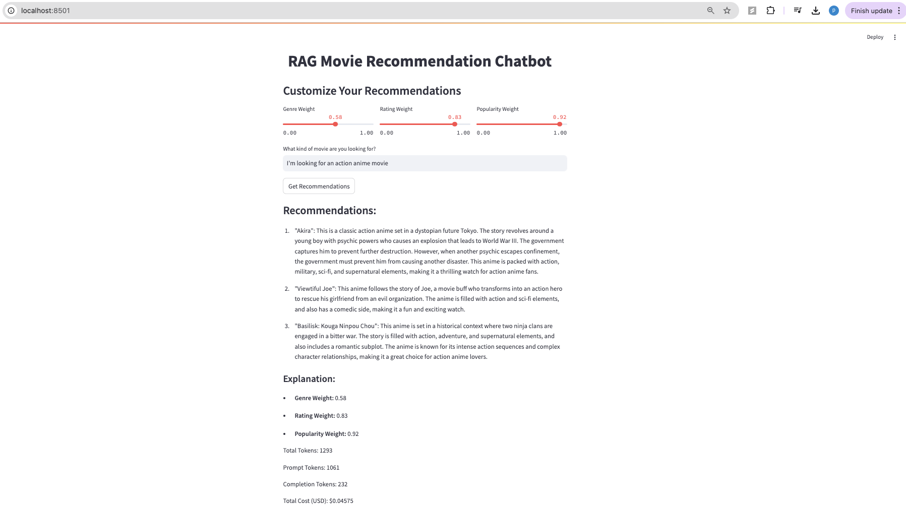

# RAG Movie Recommendation Chatbot

## Overview

The RAG (Retrieval-Augmented Generation) Movie Recommendation Chatbot is an intelligent system designed to provide personalized anime recommendations based on user input. By leveraging the capabilities of LanceDB for semantic search and OpenAI’s embedding models, this chatbot retrieves and processes relevant data to deliver accurate and contextual recommendations. The chatbot supports customization options, allowing users to fine-tune the recommendation process based on genres, ratings, and popularity.

## Workflow

<div style="display: flex; justify-content: space-between; align-items: center;">
    <div style="flex: 1; padding: 10px;">
        <p>The following diagram illustrates the overall workflow of the RAG Movie Recommendation Chatbot:</p>
        
    </div>
</div>

### Description of the Workflow:
1. **Documents:** The system starts by processing a dataset containing information about various anime, including titles, genres, synopses, and scores.
2. **Chunks:** The dataset is broken down into smaller, manageable chunks to facilitate efficient processing and embedding generation.
3. **OpenAI Embedding Model:** Each chunk is then passed through an OpenAI embedding model that converts the textual information into numerical vectors, capturing the semantic meaning of the content.
4. **Vectors:** These vectors are stored and indexed in LanceDB, a high-performance vector database optimized for semantic search.
5. **User Prompt:** When a user provides a query, the chatbot retrieves the most relevant chunks from LanceDB based on the semantic similarity to the user’s input.
6. **Retrieved Chunks:** The retrieved chunks are then processed and used to generate a contextual response.
7. **Response:** Finally, the chatbot provides the user with a list of recommended anime titles, along with a brief synopsis and the reasons for the recommendations.

## Output

<div style="flex: 1; padding: 10px;">
        <p>The image below shows the output generated by the chatbot after processing a user query:</p>
        
    </div>
    
## Features

- **Customizable Recommendations:** Users can adjust the importance of genres, ratings, and popularity to tailor the recommendations to their preferences.
- **Efficient Semantic Search:** Utilizes LanceDB for fast and accurate retrieval of relevant anime information based on semantic embeddings.
- **Integration with OpenAI Models:** Leverages the power of OpenAI’s GPT and embedding models to deliver high-quality recommendations and responses.

## Installation

To set up and run the RAG Movie Recommendation Chatbot, follow these steps:

1. Clone the repository:
   ```bash
   git clone https://github.com/yourusername/rag-movie-recommendation-chatbot.git
   cd rag-movie-recommendation-chatbot
   
2. Install the required dependencies:
   ```bash
   pip install -r requirements.txt

3. Set up your OpenAI API key by creating a .env file and adding your API key:
   ```bash
   OPENAI_API_KEY=your_openai_api_key

5. Prepare the dataset by placing your anime_with_synopsis.csv file in the root directory of the project.

## Usage

1. Run the Streamlit application:
   ```bash
   streamlit run app.py
   
2. Access the application via your web browser at http://localhost:8501.
3. Enter your preferences and query in the application interface to receive personalized anime recommendations.
